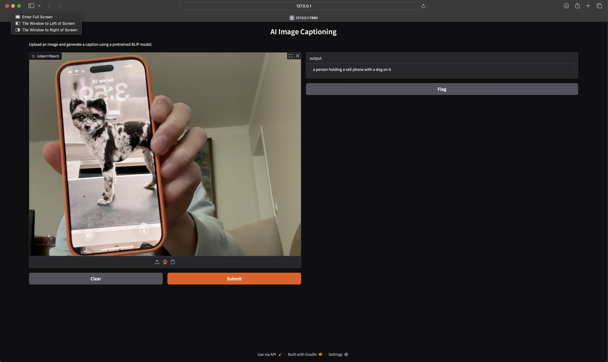

# 🖼️ AI Image Captioning App

A simple web application that generates captions for images using a pretrained BLIP (Bootstrapping Language-Image Pretraining) model from Hugging Face.

Built with Python, Transformers, and Gradio.

---

## 🚀 Demo



---

## 🧠 How It Works

1. User uploads an image
2. Image is processed using BLIP model
3. Model generates a natural language caption
4. Caption is displayed in the UI

---

## 🛠️ Tech Stack

- Python
- Hugging Face Transformers
- PyTorch
- Gradio

---

## 📦 Installation

```bash
git clone https://github.com/arnieldon-hub/image-captioning-app.git
cd image-captioning-app

python3 -m venv venv
source venv/bin/activate

pip install -r requirements.txt
python3 app.py
